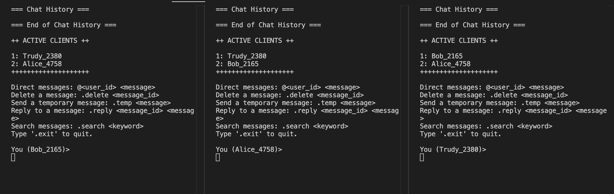
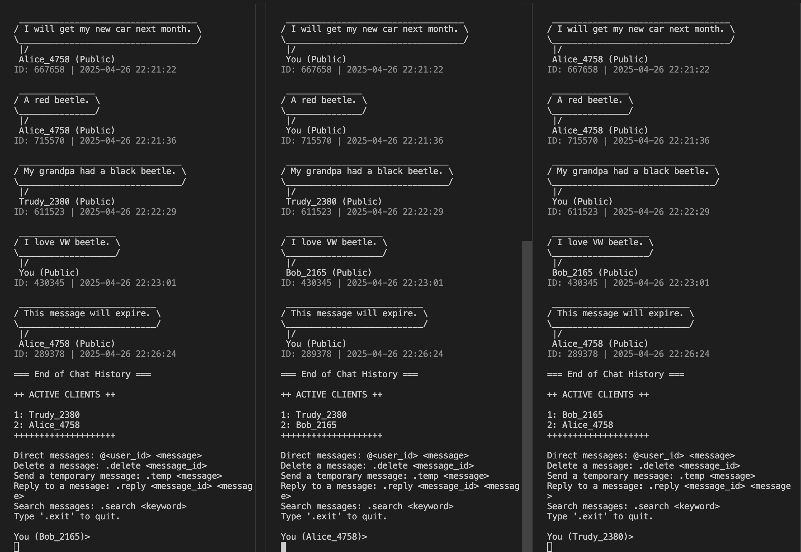

# CLIENT/SERVER RELIABLE CHAT APPLICATION

Nguyen Anh Khoa Tran

Wesley K. Marizane

COMP 3825

Instructor: Meiying Zhang

<br>

## Introduction

This project aimed to design and implement a reliable Client/Server Chat Application using a simple but highly functional architecture. The goal was to enable two or more clients to connect to a central server and exchange messages in real-time, with a focus on reliability, security, clarity, and usability.

Our chat application is built using Python 3, leveraging basic socket programming combined with TLS/SSL encryption to secure the communication between the server and clients. Each client, upon connection, is assigned a unique identifier and receives a list of available clients. Clients use these identifiers to send direct messages, which the server forwards appropriately. Our design is modular and extensible, allowing easy addition of new features.

In this project, we have also implemented advanced functionalities such as multi-client chatting, encrypted communications, message deletion, temporary messages, and a search function using regex.

<br>

## Design

### Architecture overview

The application follows a standard Client-Server architecture:

- Server: Manages all client connections, assigns unique ID for clients and their messages, forwards messages between clients, and maintains an updated list of active clients.

- Clients: Connect to the server, retrieve active clients, send and receive messages, and perform actions like search, delete, and exit.

Communication is handled through the server to maintain centralized control, security, and reliability.

<br>

### Modules and Components

#### Server

- Accepts and handles client connections.
- Assigns unique IDs.
- Forwards messages between clients.
- Updates client lists.
- Manages message expiration (temporary messages).

#### Client

- Connects securely to the server.
- Sends and receives encrypted messages.
- Displays messages in speech-bubble format.
- Supports searching, deleting, and temporary messages.

#### Unique Client Identification

When a client connects, the server generates a unique ID using a combination of their username and a random number (e.g., “John_4572”). This ID is used for direct messaging and identification.

<br>

### Message Flow

#### Client Connection

- Client connects to the server via TLS/SSL.
- Server assigns a unique ID and provides the current list of active clients.

#### Sending a Message

- The sender selects a recipient (or all) using their IDs.
- The server receives the message and forwards it to the intended clients.

#### Receiving a Message

- Clients listen continuously for incoming messages and render them in a structured speech-bubble format.

#### Client Disconnection

- Clients can disconnect gracefully using the “.exit” command.
- The server updates the active clients list and closes the socket.

<br>

## Features Implemented

- Chatting between multiple clients (required)
- TLS/SSL encryption (required)
- Message deletion
- Temporary messages
- Message searching using regex

Each feature was implemented carefully with synchronization, ensuring data consistency even with multiple active clients.

<br>

## Communication Between Clients

Clients communicate through the server. All messages are encrypted via TLS/SSL during transit to prevent interception. Clients send structured JSON data, and the server broadcasts or directly forwards the message as needed.

The architecture ensures that:
- Direct messages are private.
- Public messages are shared with all connected clients.
- Temporary messages automatically expire and are deleted.

<br>

## Installation and Running Instructions

### Requirements
- Python 3.10+
- `openssl` for generating certificates

### Installation Steps

1. Install Python 3 if not already installed.
1. Generate TLS certificates (`cert.pem`, `key.pem`) or use provided ones.
1. Place `client.py` and `server.py` in the same project directory.

### Running the Program

1. Start the server first:

    ```sh
    python3 server.py
    ```

1. Then start one or more clients in separate terminals:

    ```sh
    python3 client.py
    ```

1. Upon connection, clients will input their username and (optionally) user ID.

1. Clients can:
    - Send public messages
    - Send direct messages (`@user_id <message>`)
    - Delete messages: `.delete <message_id>`
    - Send temporary messages: `.temp <message>`
    - Search messages: `.search <keyword>`
    - Reply to messages: `.reply <message_id> <message>`

<br>

## Screenshots

- Server running:

    

- Connected clients:

    

- Direct and public messaging:

    

- Replying to a message:

    

- Deleting a message

    

- Searching for a message

    

- Temporary message auto-expiring

    

    

<br>

## Code Implementation and Function Details

### Server side

- `handle_client()`: Handles individual client sessions with different types of messages, including **action= {LOGIN, MESSAGE, DELETE, TEMPORARY, EXIT}**.
- `broadcast_message()`: Forwards messages to appropriate recipients.
- `cleanup_loop()`: Periodically removes expired temporary messages.
- `cliean_expired_message`: check whether temporary messages are expired and broadcast the message indicating which message is expired and need to be updated in the client message database. 
- `generate_user_id`: Create a unique Id for user by appending user's name with 4-digit random number.
- `generate_message_id`: Create a unique message ID with 6-digit random number.
- `remove_conenction`: Remove client socket information according to given client ID.
- `update_active_client_list`: generate and broadcast message with **action = ACTIVE_CLIENT** to announce all clients about the number of active clients in the chat room.


### Client side

- `receive_messages()`: Listens and renders incoming messages.
- `speech_bubble()`: Beautifies messages in terminal.
- `search_messages()`: Finds messages containing a keyword using regex and displays them in a new terminal window.
- `open_search_txt` : Open **search.txt** in a new terminal and leave it open after printing.
- `clear_screen()`: call OS function to clear all the current ouput on the terminal.
- `render_message()`: call clear_screen function and reprint all the messages.
- `extract_message_and_users`: function to parse user's input to get all client ID and the message.
- `extract_temp_message`: function to parse user's input with **temp** keyword to get all client ID and the message.
- `extract_reply_message` : function to parse user's input with **reply** keyword to get message ID and the message.
- `main`: handle user logging in and sending messages with different actions, inclduing **action = {LOGIN, MESSAGE, DELETE, TEMPORARY, SEARCH, EXIT}**

### Message format

```Python
data = {
    "id": 235467,
    "action": ’MESSAGE’,
    "sender": ‘Tom_8386’,
    "receiver": [‘Alice_5678’,’Trudy_8901’],
    "content": ‘Hello Alice and Trudy!’,
    "time": 2025-04-20 10:54:03,
    "private": True,
    "optional": None
}
```

- `id`: message ID
- `action`: method of the message, including **{LOGIN, MESSAGE, DELETE, TEMPORARY, EXIT}**
- `sender`: user ID of the sender
- `receiver`: a list of all receivers' ID for the message
- `content`: the message content
- `time`: timestamp of the message.
- `private`:
    + `True`  - only specified receivers will receive the message
    + `False` - all clients in the chat room receive the message
- `optional`: place to put the message ID for **DELETE** and **REPLY** method.  

Both sides use multithreading to handle multiple messages and connections asynchronously.

<br>

## Evaluation and Results

Our chat application met all the basic and bonus requirements. It proved stable under multiple connections, reliably handled encrypted communication, and supported advanced features like search and temporary messages. The modular design allows for easy future extensions like media file support or message history logging.

Testing showed:
- Secure connection established (TLS handshake).
- Real-time messaging with minimal delay.
- Accurate deletion and expiration of temporary messages.
- Reliable search results with keyword matching.

<br>

## Conclusion

This project successfully demonstrated a robust and extensible client/server chat system. Through this work, we gained valuable hands-on experience in network programming, encryption, multithreading, and synchronization. The bonus features enhanced usability, and the modular design ensures the system can be expanded further if needed.

We are confident that the application meets all project requirements and honors criteria, providing a secure, functional, and user-friendly communication platform.

<br>

## Appendix
Project sources and references were cited from:

- <a href="pythonprogramming.net/server-chatroom-sockets-tutorial-python-3/">Creating chat application with sockets in Python</a>
- <a href="https://docs.python.org/2/library/ssl.html">Python SSL documentation</a>
- <a href="google.com">GeeksforGeeks Socket Programming tutorials</a>
- <a href="https://docs.openssl.org/3.0/man1/openssl-req/">OpenSSL req manual to generate key and certificate</a>
- <a href="https://docs.python.org/2/library/ssl.html">TLS/SSL wrapper for socket objects</a>
- <a href="https://www.geeksforgeeks.org/get-current-date-and-time-using-python/">How to get current date and time using Python </a>
- <a href="https://www.geeksforgeeks.org/python-convert-json-to-string/"> Convert between JSON format and string </a>